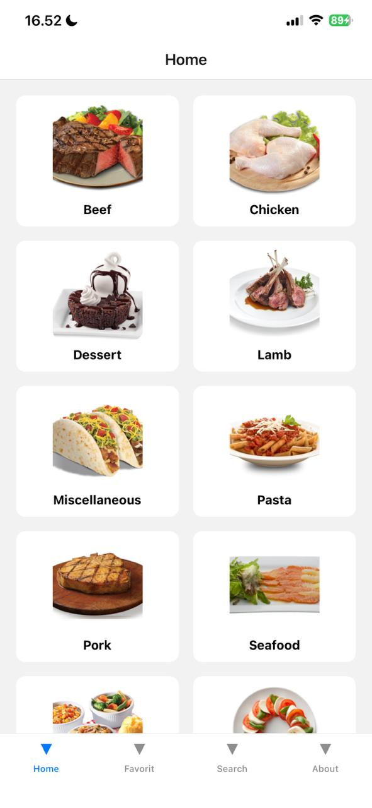
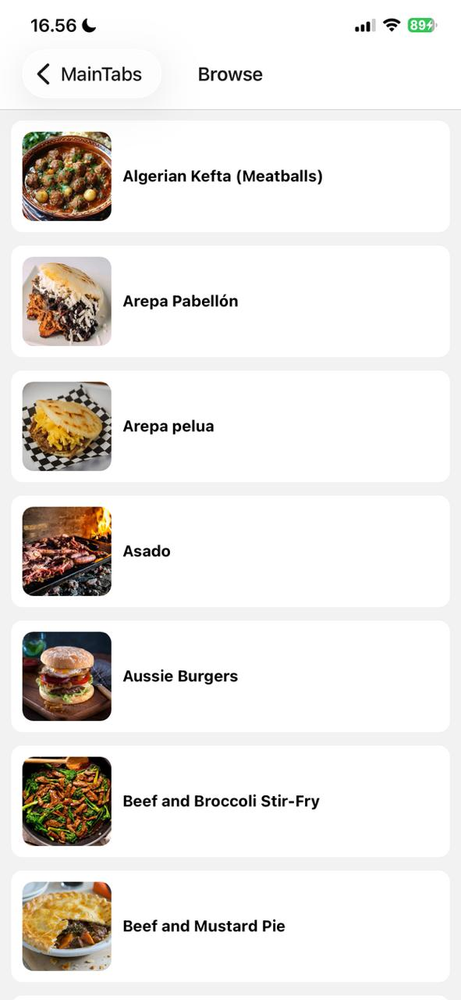
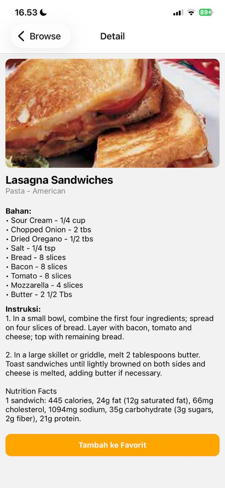
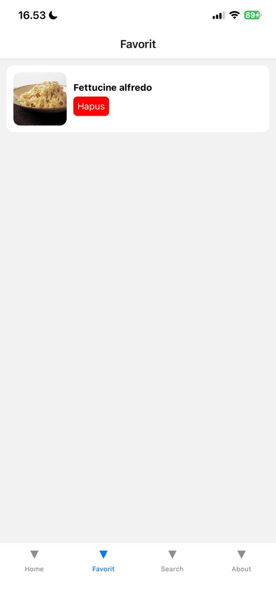
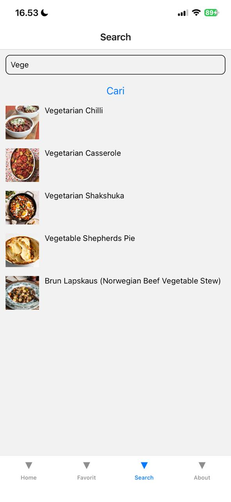
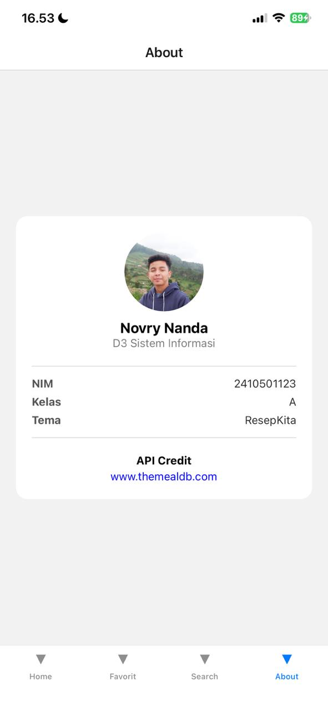

# Mini Catalog App - ResepKita

## Identitas
- Nama: Novry Nandaa
- NIM: 2410501123
- Kelas: A
- Tema: A (ResepKita - Katalog Resep Kuliner)

---

## Tech Stack
- React Native (Expo)
- JavaScript
- React Navigation (Stack + Bottom Tabs)
- Context API + useReducer (State Management)
- Fetch API

---

## Cara Menjalankan Project

```bash
git clone https://github.com/Camii1i/uts-mobile-lanjut-2410501123-Novry-Nanda-Kurniaputra
cd uts-mobile-lanjut-2410501123-Novry-Nanda-Kurniaputra
npm install
npx expo start

```
---

## Pembahasan Aplikasi

Aplikasi yang dibuat merupakan aplikasi katalog resep kuliner berbasis mobile menggunakan React Native dan Expo. Aplikasi ini memanfaatkan API dari TheMealDB untuk menampilkan data secara dinamis.

Pada HomeScreen, aplikasi menampilkan kategori makanan dalam bentuk grid. Ketika user memilih kategori, akan diarahkan ke BrowseScreen untuk melihat daftar resep berdasarkan kategori tersebut.

Selanjutnya, DetailScreen digunakan untuk menampilkan informasi lengkap dari resep, termasuk bahan dan instruksi memasak. Pada halaman ini juga terdapat fitur untuk menambahkan resep ke dalam favorit.

State management menggunakan Context API dan useReducer untuk mengelola data favorit secara global agar dapat diakses di berbagai screen.

Fitur pencarian memungkinkan pengguna mencari resep berdasarkan nama dengan validasi minimal 3 karakter.

Terakhir, AboutScreen menampilkan informasi pembuat aplikasi dan sumber API yang digunakan.

---

## Screenshot

### HomeScreen


### BrowseScreen


### DetailScreen


### FavoritesScreen


### SearchScreen


### AboutScreen


---

## State Management

Aplikasi ini menggunakan **Context API dan useReducer** untuk mengelola data favorit secara global. Data favorit digunakan untuk menyimpan daftar resep yang dipilih oleh pengguna agar dapat diakses di berbagai screen seperti DetailScreen dan FavoritesScreen.

Dengan menggunakan Context API, state dapat dibagikan ke seluruh komponen tanpa perlu melakukan prop drilling. Sedangkan useReducer digunakan untuk mengatur logika perubahan state seperti menambahkan dan menghapus item dari daftar favorit.

### Alasan Pemilihan
State management ini dipilih karena:
- Tidak memerlukan library tambahan
- Lebih sederhana dibanding Redux
- Cocok untuk aplikasi skala kecil hingga menengah

### Kelebihan
- Mudah diimplementasikan
- Struktur kode lebih rapi
- Built-in dari React

### Kekurangan
- Kurang optimal untuk aplikasi berskala besar
- Tidak memiliki fitur debugging seperti Redux DevTools\


---

## Link Video DEMO
- Link GDrive : https://drive.google.com/file/d/1okMKDIIjT3wqyQ3jmNnNIZ6b0VoQv2gY/view?usp=drivesdk
---

## Referensi
- https://react.dev/reference/react/useReducer  
- https://react.dev/reference/react/useContext  
- https://www.youtube.com/watch?v=m1-bc53EGh8&t=151s

---

## Refleksi

Dalam pengerjaan aplikasi ini, saya mengalami beberapa kendala terutama dalam memahami alur navigation antar screen menggunakan React Navigation. Pada awalnya, saya cukup kesulitan dalam mengirim data antar screen menggunakan navigation params, sehingga sering terjadi error ketika membuka halaman Detail.

Selain itu, saya juga mengalami kendala dalam penggunaan state management menggunakan Context API dan useReducer, terutama dalam mengelola data favorit agar dapat ditambahkan dan dihapus dengan benar. Namun, setelah mempelajari kembali konsep reducer dan struktur state, saya akhirnya dapat mengimplementasikan fitur favorit dengan baik.

Integrasi API juga menjadi tantangan tersendiri, terutama dalam menangani loading state dan error handling agar aplikasi tetap berjalan dengan baik ketika terjadi gangguan jaringan.

Dari proyek ini, saya mendapatkan pemahaman yang lebih baik mengenai pengembangan aplikasi mobile menggunakan React Native dan Expo, khususnya dalam hal navigation, state management, serta pengolahan data dari API eksternal. Selain itu, saya juga belajar pentingnya struktur kode yang rapi dan commit Git secara bertahap selama proses pengembangan.